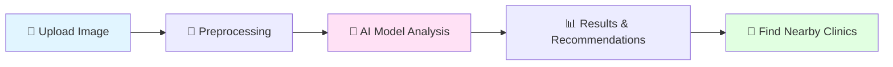

<div align="center">


# 🌟 Stratum - AI-Powered Skin Disease Detection

### *Your Intelligent Dermatology Companion* 🏥✨

[](https://www.python.org/)
[](https://flask.palletsprojects.com/)
[](https://github.com)
[](https://github.com)

</div>

---

## 📖 About The Project

**Stratum** is a cutting-edge web application that harnesses the power of artificial intelligence to revolutionize skin disease detection and dermatological care. Built by the **Mavericks** team for the **RockBees Hackathon**, this platform provides instant, accurate skin condition analysis and connects users with nearby dermatology clinics.

### 🎯 Mission

To make professional dermatological insights accessible to everyone, anywhere, anytime through advanced AI technology.

---

## ✨ Key Features

<div align="center">

| 🤖 **AI Analysis** | 📍 **Clinic Finder** | 🔬 **Disease Detection** |
|:------------------:|:--------------------:|:------------------------:|
| Advanced ML model for instant skin analysis | Find dermatology clinics within 50km radius | Accurate detection of multiple skin conditions |
| Real-time predictions | Location-based recommendations | Support for various skin types |

</div>

### 🩺 Supported Conditions

Our AI model can detect and analyze:

- 🔴 **Acne** - Advanced acne detection and severity assessment
- 💧 **Oily Skin** - Identifies excess sebum production
- 🏜️ **Dry Skin** - Detects skin dehydration and dryness
- 🌡️ **Other Dermatological Conditions** - Expanding detection capabilities

---

## 🚀 Getting Started

### Prerequisites

Make sure you have the following installed:

- 🐍 **Python 3.8+**
- 📦 **pip** (Python package manager)
- 🌐 **Modern Web Browser**

### 📥 Installation

```bash
# Clone the repository
git clone https://github.com/DarshanKumarM8/Mavericks-RockBees-Hackathon-StageX.git

# Navigate to project directory
cd Mavericks-RockBees-Hackathon-StageX

# Install dependencies
pip install -r requirements.txt
```

### ▶️ Running the Application

```bash
# Start the Flask server
python app.py

# Access the application
# Open your browser and navigate to: http://localhost:5000
```

---

## 💡 How It Works



1. **📤 Upload** - User uploads a clear image of the affected skin area
2. **🔍 Analyze** - AI model processes and analyzes the image
3. **📋 Results** - Receive instant predictions with confidence scores
4. **🏥 Connect** - Find nearby dermatology clinics for professional consultation

---

## 🛠️ Technology Stack

<div align="center">

### Backend


### Frontend


### Tools & Services


</div>

---

## 📸 Screenshots

> *Screenshots showcase the sleek, modern interface and powerful features*

### 🏠 Home Dashboard
Beautiful, intuitive interface designed for seamless user experience

### 🔬 Analysis Results
Detailed predictions with visual feedback and confidence metrics

### 📍 Clinic Finder
Interactive map showing nearby dermatology clinics and hospitals

---

## 🌐 Deployment

### Using Ngrok Tunnel

```bash
# Run the tunnel script to expose localhost to the internet
python tunnel.py

# Share the generated public URL with anyone!
```

---

## 🎯 Roadmap

- [x] ✅ Core AI model implementation
- [x] ✅ Acne detection enhancement
- [x] ✅ Clinic finder integration
- [x] ✅ Responsive web interface
- [ ] 🔄 Multi-language support
- [ ] 🔄 Mobile app development
- [ ] 🔄 Expanded disease database
- [ ] 🔄 User authentication & history

---

## 👥 Team Mavericks

Built with ❤️ by passionate developers committed to making healthcare accessible

<div align="center">

**🏆 RockBees Hackathon - StageX**

</div>

---

## 📝 License

This project is part of the RockBees Hackathon initiative.

---

## 🤝 Contributing

We welcome contributions! Feel free to:

1. 🍴 Fork the repository
2. 🌿 Create a feature branch (`git checkout -b feature/AmazingFeature`)
3. 💾 Commit your changes (`git commit -m 'Add some AmazingFeature'`)
4. 📤 Push to the branch (`git push origin feature/AmazingFeature`)
5. 🔃 Open a Pull Request

---

## 📧 Contact & Support

Got questions? Need help? Reach out!

- 💬 Open an issue on GitHub
- 📧 Email the team
- 🌟 Star this repo if you find it useful!

---

<div align="center">

### 🌟 Star this repository if you found it helpful! 🌟

**Made with 💜 and lots of ☕**

---

*Empowering better skin health through AI* 🚀

</div>