# 🐝 DorsataSentry

### *AI-Driven Urban Coexistence with the Giant Rock Bee* 🏙️

**"From Reactive Destruction to Proactive Coexistence."**

> *A Mobile-First "Software-as-a-Sensor" Platform for Optical Colony Detection, Geo-Spatial Monitoring & Ethological Safety.*

---

## 1. 🌏 Overview: Bees & The Urban Rock Bee

India’s apiculture landscape is diverse, but one species dominates the urban skyline. Unlike the docile European honeybee (*Apis mellifera*) which hides in boxes, the **Giant Rock Bee (*Apis dorsata*)** is a wild, open-nesting species that cannot be domesticated.

### 🏙️ The "Urban Cliff" Phenomenon
*Apis dorsata* naturally nests on high cliffs. In modern cities, they mistake **high-rise apartments, water tanks, and balconies** for limestone caves. This migration brings them into direct conflict with humans.

---

## 2. 🚨 The Need for Colony Monitoring

The conflict between rapid urban development and *Apis dorsata* is driven by a **lack of visibility**.

*   **The Status Quo:** Communities react with panic only *after* a stinging incident.
*   **The Consequence:** Unscientific "pest control" (fire/chemicals) is used. This kills thousands of pollinators, destroys brood, and contaminates honey.
*   **The Void:** There is currently **zero technology** for non-invasive, remote monitoring of wild, open-nesting bees.

---

## 3. 🔬 Research Topics

### A. Types of Bees in India
To build a solution, we first distinguished our target from other species:

| Species | Type | Nesting Style | Urban Status |
| :--- | :--- | :--- | :--- |
| **Apis dorsata** | **Wild** | **Open, Single Massive Comb** | **High Conflict (The Target)** |
| *Apis cerana* | Domesticated | Cavities / Boxes | Managed |
| *Apis florea* | Wild | Tiny Single Comb (Bushes) | Low Risk |
| *Tetragonula* | Wild | Crevices (Stingless) | No Risk |

### B. Rock Bee Habitat & Colony Patterns
*   **Open-Air Architecture:** They require clear flight paths and build nests up to 1.5m wide.
*   **Philopatry (The Return):** Colonies are migratory but exhibit **site fidelity**, returning to the *exact same balcony* year after year, guided by pheromone traces.
*   **Defense "Curtain":** A living blanket of bees covers the comb. They use a visual **"Shimmering"** wave to warn off predators.

### C. Risks to Communities
*   **Mass Stinging:** Unlike other bees, *Apis dorsata* attacks in swarms. Multiple stings can cause anaphylactic shock or renal failure.
*   **Hygiene:** Bee feces and leaking honey damage property.
*   **Panic:** The psychological "fear factor" leads to expensive and destructive removal costs.

### D. Existing Detection Methods & Gaps
> *Current solutions fail because they are designed for boxes, not balconies.*

*   ❌ **Beekeeping Apps:** Only work for managed hives.
*   ❌ **Acoustic Sensors:** Require placement *inside* the hive (impossible for wild bees).
*   ❌ **Drone Surveillance:** Noisy rotors trigger attacks.

---

## 4. 🧩 Problem Breakdown

We deconstructed the problem into three actionable technological challenges:

1.  **DETECTION (The "Finder"):** How do we verify a hive is *Apis dorsata* from 20 meters away *without* getting close?
    *   *Solution:* **Computer Vision (YOLOv8)**
2.  **LOCATION (The "Tracker"):** How do we predict where they will nest next season?
    *   *Solution:* **Geo-Spatial "Hive Atlas" & Crowdsourcing**
3.  **SAFETY (The "Guardian"):** How do we know if they are about to attack?
    *   *Solution:* **Ethological Analysis (Shimmering & Hissing detection)**

---

## 5. 💡 The Solution: DorsataSentry

**DorsataSentry** is a Flutter-based mobile application that turns a standard smartphone into a remote **bio-sensor**.

### 🔭 Module 1: HiveScout (Optical Detection)
**Tech:** YOLOv8 (TensorFlow Lite)

Instantly validates if a dark patch on a building is a Rock Bee colony, differentiating it from wasp nests or AC units.

---

### 🗺️ Module 2: Migratory Map (Geo-Spatial)
**Tech:** Firebase GeoFirestore

Tracks "Active" vs. "Dormant" sites. Uses historical data to send **Philopatry Alerts** to residents *before* migration season begins.

---

### 💓 Module 3: BioSense (Safety Analysis)
**Tech:** OpenCV (Optical Flow) + Audio FFT

*   **Visual Safety:** Detects "Shimmering"—the rhythmic defense wave (**0.3–0.8 m/s**) that signals agitation.
*   **Audio Safety:** Detects the specific "Hissing" frequency (**400Hz–6kHz**) that precedes a mass attack.

---

## 📊 System Architecture

```mermaid
graph TD
    User["📱 User / 'Urban Ecologist'"] -->|Points Camera| Detect["🔭 HiveScout: Detection"]
    Detect -->|YOLOv8 Identification| ID{"Is it Apis dorsata?"}
    ID -->|No / Wasp| Alert["🚫 Warning: Pest"]
    ID -->|Yes| Locate["🗺️ Migratory Map: Localization"]
    
    Locate -->|GPS + History| Map["📍 Pin on Atlas"]
    Locate -->|Check Season| Philopatry["🔄 Philopatry Alert"]
    
    Map -->|Analyze Video| Monitor["💓 BioSense: Safety"]
    Monitor -->|Eulerian Mag + Optical Flow| Shimmer["🌊 Detect Shimmering"]
    
    Shimmer -->|Calculate Agitation| Safety{"Risk Level"}
    Safety -->|Low| Safe["🟢 Safe / Dormant"]
    Safety -->|Med| Caution["🟡 Caution / Local Wave"]
    Safety -->|High| Danger["🔴 DANGER / Mass Attack"]
```

---

## 📚 References

1.  **Wardhe, D.S. & Ghonmode, S.V. (2024).** *Nesting pattern of Apis dorsata F. in urban Nagpur.* Entomon, 49(4): 539-544.
2.  **Oldroyd, B.P., et al. (2000).** *Colony aggregation and seasonal migration in Apis dorsata.*
3.  **Kastberger, G., et al. (2008).** *Social waves in giant honeybees repel wasps.* PLOS ONE.
4.  **Wehmann, H., et al. (2015).** *The Sound and the Fury—Bees Hiss when Expecting Danger.* PLOS ONE.
5.  **Shaw, J.A., et al. (2005).** *Polarization lidar for detection of honey bees.* Optics Express.

---

**🏆 Built for Hackathon 2025**

*Promoting Urban Biodiversity through AI* 🌿

